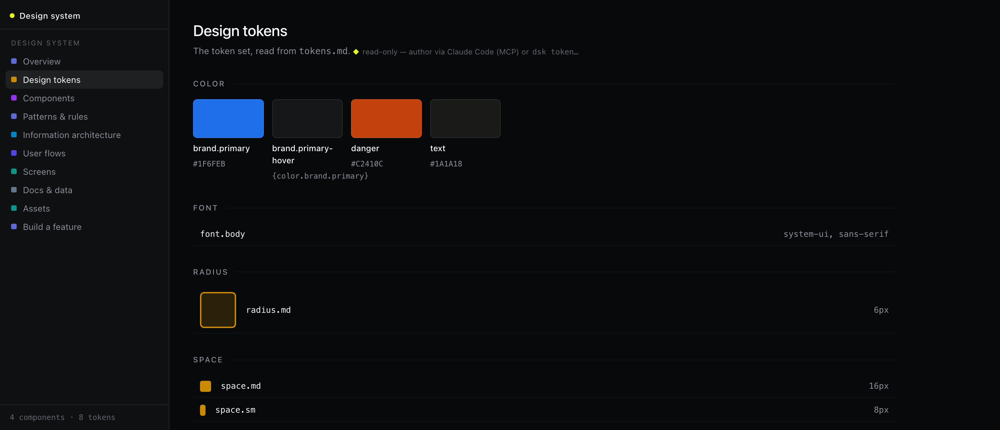
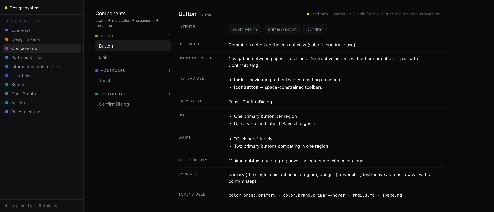

# dsk — design-system memory toolkit

[](https://github.com/rabindranath1311/dsk/actions/workflows/ci.yml)
[](LICENSE)

A single self-contained toolkit that gives one product's design system a
**memory** — tokens, components, usage rules, patterns, flows, and screens —
readable by humans *and* by AI coding assistants. One folder = one design
system. It **builds** the design system, **shows** it, and lets an **agent use
it** over MCP.

**Website:** https://rabindranath1311.github.io/dsk/ · **How it works:** [HOW-IT-WORKS.md](HOW-IT-WORKS.md)



## Why

Design systems usually live as tribal knowledge, scattered Figma files, and
stale wikis. Agents (and new teammates) can't use any of that. dsk stores the
system as structured, versionable data beside your code — with explicit
"use when / don't use when" rules per component — so an AI assistant can pick
the right component, obey the guidelines, and even author new entries.

## The three faces (over one core)

- **`@dsk/core`** — the kernel: the store (human-readable file repo or SQLite),
  the node model, DTCG design tokens, exporters. The source of truth.
- **`@dsk/cli`** — the `dsk` command: **the builder**
  (`init`, `token`, `component`, `pattern`, `guideline`, `import`, `export`,
  `feature`, `recommend`, `lint`).
- **`@dsk/server` + `@dsk/web`** — `dsk serve`: **the viewer** — a React
  visualizer + JSON API + the MCP endpoint, in one process.
- **`@dsk/mcp`** — **the agent surface**: the MCP server Claude Code (or any
  MCP client) plugs into to read, lint, and author the design system.



## Quickstart

Requires Node.js 20+.

```sh
git clone https://github.com/rabindranath1311/dsk
cd dsk
npm install

# create a design system in this folder and load the example seed
npm run dsk -- init --name "Acme"
npm run dsk -- import examples/seed.acme.json

# build the visualizer once, then serve it
npm run build:web
npm run serve            # → http://localhost:4321
```

Then edit from the command line and watch the projections regenerate:

```sh
npm run dsk -- token set color.brand.primary "#1F6FEB"
npm run dsk -- component new IconButton --level atom --when "space-constrained toolbars"
npm run dsk -- export    # → design-system/tokens.css + design.md + AGENTS.md + SKILL.md
```

Prefer a fully human-readable store? `dsk init --files` keeps everything as
markdown files instead of SQLite — diffable and reviewable in PRs.

## Use it from Claude Code (MCP)

```sh
npm run dsk -- mcp-config   # writes .mcp.json (HTTP → http://localhost:4321/mcp)
npm run serve               # keep the server running
```

Open the folder in Claude Code and it connects automatically. The agent can
then search components by intent, check usage rules, lint proposed UI against
the guidelines, and author tokens/components/patterns — all against the same
store the visualizer shows.

## What's in the memory

| Kind | What it captures |
| --- | --- |
| Tokens | DTCG-format design tokens (color, space, radius, type…) with aliases |
| Components | Atomic-design level, intents, variants, *use-when / don't-use-when*, do/don't, a11y notes, tokens used |
| Patterns & guidelines | Recurring solutions and the cross-cutting rules that govern components |
| IA & flows | App maps and user flows as draggable node graphs |
| Screens | Purpose, states, and the components each screen uses |
| Docs & assets | PRDs, brand refs, research, icons/images — the grounding agents read |

## Develop

```sh
npm install
npm test             # vitest
npm run typecheck    # tsc across all packages
```

The store is the source of truth; everything else is a projection. Editing a
token and re-exporting regenerates `tokens.css` + `design.md`. Builder (CLI),
viewer (`dsk serve`), and the agent surface (MCP) are three faces over the same
`@dsk/core`.

## License

[MIT](LICENSE)
